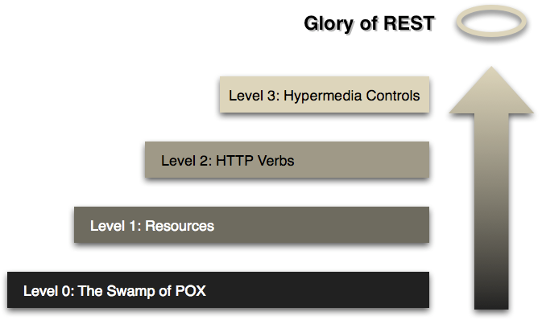

## Modèle de Richardson

Le modèle de Richardson, également connu sous le nom de modèle de maturité de Richardson, est un modèle utilisé pour évaluer la maturité d'un projet ou d'une organisation dans le domaine du développement logiciel. Il a été proposé par Leonard Richardson et décrit les différentes étapes de maturité qu'une organisation peut atteindre dans la mise en œuvre de pratiques de développement logiciel efficaces.

### Level 0 : The Swamp of POX
Ce niveau représente une approche désorganisée et non structurée du développement d'API. Les services sont exposés via des URI (Uniform Resource Identifiers) arbitraires et les données sont échangées de manière non standardisée, souvent en utilisant des formats tels que XML ou JSON sans aucune convention commune.
### Level 1 : Resources
Au niveau 1, les services commencent à adopter une approche plus structurée en exposant des ressources via des URI bien définies. Les URI représentent les entités ou les objets manipulés par l'API, et les opérations de base telles que la création, la lecture, la mise à jour et la suppression sont effectuées en utilisant les méthodes HTTP appropriées.
### Level 2 : HTTP Verbs
Au niveau 2, l'utilisation des verbes HTTP pour représenter les différentes opérations devient plus systématique. Plutôt que d'utiliser des URI spécifiques pour chaque opération, les verbes HTTP tels que GET, POST, PUT et DELETE sont utilisés pour indiquer l'action souhaitée sur une ressource.
### Level 3 : Hypermedia Controls
Le niveau 3 représente le sommet de la maturité selon le modèle de Richardson. À ce niveau, les services exposent non seulement les ressources et les opérations, mais également les liens hypertexte qui permettent la navigation et la découverte des fonctionnalités de l'API. Les clients peuvent utiliser ces hyperliens pour accéder aux ressources connexes et interagir avec l'API de manière dynamique.

## Comment le modèle de Richardson est respecté
Dans le cadre du projet, j'ai pris en compte le modèle de Richardson pour concevoir et développer l'API. J'ai implémenté les niveaux du modèle de la manière suivante :

**Level 1 :** J'ai structuré l'API en exposant des ressources clés via des URI bien définies. Chaque ressource est accessible via un chemin d'URI spécifique, ce qui facilite l'accès et la manipulation des données.

**Level 2 :** J'ai utilisé les verbes HTTP appropriés (GET, POST, PUT, DELETE) pour indiquer les opérations à effectuer sur les ressources. Cela permet une utilisation cohérente des méthodes HTTP standardisées.

